# Group Project: Design Journey

**For each milestone, complete only the sections that are labeled with that milestone.** Refine all sections before the final submission.

You are graded on your design process. If you later need to update your plan, **do not delete the original plan, leave it in place and append your new plan _below_ the original.** Then explain why you are changing your plan. Any time you update your plan, you're documenting your design process!

**Replace ALL _TODOs_ with your work.** (There should be no TODOs in the final submission.)

Be clear and concise in your writing. Bullets points are encouraged.

**Everything, including images, must be visible in _Markdown: Open Preview_.** If it's not visible in the Markdown preview, then we can't grade it. We also can't give you partial credit either. **Please make sure your design journey should is easy to read for the grader;** in Markdown preview the question _and_ answer should have a blank line between them.

## Client (Milestone 1)

### Client Description (Milestone 1)

> Tell us about your client. Who is your client?
> Explain why your client meets the client rules in the project requirements.

- TEDxCornell is a club at Cornell. It hosts annual speaking events and focuses on sharing new opinions and ideas.
- TEDxCornell meets our project requirements because the website is not made for any specific member on our team. TEDxCornell is a professional organization that has real needs and wants to have a redesigned website.

### Client Questionnaire (Milestone 1)

> Develop a client questionnaire to learn more about your client and their goals.
> You may use the questionnaire below, you may modify the questionnaire below, or you may create your own.

1. Describe your organization and its purpose.

   - TEDxCornell is an organization dedicated to giving a platform to people with unique opinions
   - Is a student run organization located at Cornell University
   - Provides a voice to people who otherwise wouldn’t have one
   - Gathers a large variety of people

2. What makes your organization and its services special or unique?

   - Sponsored by the official TEDx
   - Sponsored by local companies

3. Why are you looking for a new website or updating your existing site?

   - Thinks there needs to be a better form
   - Wants to change from google forms to internal forms on the website
   - Wants improvements on the presentation of the website
   - Thinks presentation contribute a lot to the website (specifically appealing to viewer)

4. Who do you want to visit your site? Who do you believe is your website's intended audience?

   - Cornell students
   - Maybe attract speakers (professors …)

5. When visiting your site, what actions do you want your visitors to take?

   - Would like an “about” page
   - FAQ would be nice
   - Page on sponsorships
   - Some information on past events
   - How to apply to be on TEDxCornell page

6. What are your goals for this site?

   - To make the website and the organization look professional
   - To learn more about TEDxCornell
   - To attract speakers

7. Is there a "feel" that you want for your site? Are there colors or imagery that you have in mind?

   - More professional website
   - More formal
   - Sharp contrast between the images and the white background
   - More formal and sophisticated font

8. What are your favorite competitors or similar organizations' websites? Why?

   - The official website TED: neat; efficient representation of information, look professional
   - Cornell Blockchain: background black and white, look professional

9. Besides the content of the existing site, what else do you want to add? Will you provide it to us?

   - New images for the website

### First Client Meeting Minutes/Notes (Milestone 1)

> Include your notes/minutes from your first meeting with your client.

- Meeting took roughly 15 minutes
- Attendees: all members and the client
- See notes above
- Main points:
  - Seemed to have wanted a more professional and formal website
  - Wanted to attract people who want to speak for TEDxCornell
  - Formal font
  - Emphasis on wanting a forms page (unfortunately we cannot have forms for this project and we talked to the client about this)
  - Focus on design and presentation

### Client Website (Milestone 1)

NOTE: after meeting with the client, we discussed and wrote the rationale together.

> Tell us about the website that your client wants.
> Tell us the purpose of the website and what it is all about.
> Note: **If you are redesigning an existing website, give us the current URL and some screenshots of the current site.** (FireFox makes it easy to take a full screenshot of a page from the context menu (right click).)
> If you are redesigning an existing site, tell us how you plan to update the site in a significant way that meets the project's requirements.

- Our client wants a new website for the TEDxCornell club with a more formal and professional look. Formal fonts like sans serif and plain white background are in our design choices.
- The purpose of this website is to attract potential speakers for TEDxCornell and for viewers to learn more about what TEDxCornell is all about. Specifically, information about the club's history, members, events, and how to get involved will be provided. The website will also have an entry for the audience to apply as a speaker or a member.

- https://www.tedxcornell.com/team <- Current website link for TEDxCornell
  
  
  

- We are planning to upgrade the presentation of the current website and make it more responsive to screen size changes. Some sessions of the existing site look weird on mobile such as the footer and the apply page.
- We also want to add more images and change the organization of the current pages to make it more readable and appealing to the viewer. There are currently five pages of the site. We will reorganize the content into four pages so that the organization is improved and the project requirement is satisfied.

### Client Goals (Milestone 1)

> Identify your client's goals for the website.
> What kind of website do they want? What are their goals for the site?
> There is no required number of goals. You need as many goals as necessary to reflect your client's desires.

- To build up a general impression on the audience about TEDxCornell (professional)
- To provide information about the club to the audience (the organization and events)
- To attract speakers and members
- To enable potential speakers or members to apply through the site

### Client Website Scope (Milestone 1)

> We want your project to be successful! It needs to be ambitious, but not too large.
> A good rule-of-thumb is that you should have about 1 content-full page for each team member.
> Explain why the website you will create for your client isn't too small and isn't too big.
> Explain why you think it's the right size for this project.

- Most of the content will be recycled from the existing website, which has substantial content. The client also asked us to add more content like images. So the website will not be small.
- We will focus on making our content concise and thorough for our viewers. We will also decide which content should not be included if it does not meet the audience's goals. So the website does not get too big.
- As planned, each member will work on one page. We will make the content for each page about the same.

## Plan/Schedule (Milestone 1)

> Make a plan of when you will complete all parts of this assignment.
> This plan is for your team. There is no required format. Format it so that it works for you!
> Your plan should include when you will interview users and analyze their goals.
> Your plan should also include how and when you will assemble/create the sit's content.
> **Tip:** Your team should plan to work ahead. This project really isn't feasible to complete the night before a deadline.

- We aim to complete all milestones on time.
- Week 1: Complete user interviews and website goals.
- Week 2: Complete skeleton code (layout, code organization, etc.)
- Week 3: Fill in pages with content and add styles
- Week 4: Add interactivity

## Understanding Users (Milestone 2)

**Make the case for your decisions using concepts from class, as well as other design principles, theories, examples, and cases from outside of class.**

You can use bullet points and lists, or full paragraphs, or a combo, whichever is appropriate. The writing should be solid draft quality, but it doesn't have to be fancy.

### User Interview Questions (Milestone 2)

> Plan the user interview which you'll use to identify the goals of your site's audience.
> You may use the interview template below and revise it as much as you desire.

**User Interview Briefing & Consent:** "Hi, I am a student at Cornell University. I'm currently taking a class on web design and for a project, I am designing the website for TedxCornell. I'm trying to learn more about the people that might use this site. May I ask you a few questions? It will take about 10 minutes. You are free to quit at any time."

1. Please tell me a bit about yourself. You may omit any personal or private information.

2. Recall the last time you visited a club/organization website.

- What information were you looking for?
- Did you find it?
- Did you find the website helpful? Why or why not?
- Does the website design affect your opinion of the club?

3. Have you visited a well-designed website that looked fine on a desktop but not on mobile? How did it affect your opinion of the the club?

4. Recall the last time you visited any website, were there any features that made the website more accessible, such as a hamburger menu?

5. Do you know about TED? Have you had any experience with it (attending in-person talks, watching recordings online, speaking, etc.)?

- If yes, did you visit any website for that experience?
- What was your impression of the website?
- Did you find the website helpful? Why or why not?

...

n. What haven't I asked you today that you think would be valuable for me to know?

**After the interview:** "This was really helpful. Thank you so much for agreeing to speak with me today. Have a great day!"

### Interview Notes (Milestone 2)

> Interview at least 1 person for every member of your team from your audience.
> Take notes and include those notes here. Make sure to include a brief description of each interviewee.
> **Copy the interview questions above into each interviewee section below.**
> Take notes for each participant inline with the questions.

**Interviewee 1:**

Monica Lee is a second-year student at Cornell; she is a transfer from Boston College.

1. Please tell me a bit about yourself.

   - sophomore
   - hotelie
   - transfer from boston college

2. Recall the last time you visited a club/organization website.

- What information were you looking for?
- Did you find it?
- Did you find the website helpful? Why or why not?
- Does the website design affect your opinion of the club?

  - TEDxCornell
  - previous event information
  - yes
  - it does shape first impression, having a poorly-designed website could negatively affect first impressions

3. Have you visited a well-designed website that looked fine on a desktop but not on mobile? How did it affect your opinion of the the club?

   - text overlap makes content hard to read
   - negatively impacts opinion of club
   - not well-run/organized.

4. Recall the last time you visited any website, were there any features that made the website more accessible, such as a hamburger menu?

   - didn't pay much attention to these things, but mentioned hamburger menu after explaining what it was.

5. Do you know about TED? Have you had any experience with it (attending in-person talks, watching recordings online, speaking, etc.)?

- If yes, did you visit any website for that experience?
- What was your impression of the website?
- Did you find the website helpful? Why or why not?

  - yes; visiting TEDxCornell's website
  - thinks the TEDxCornell website could be designed better
  - helpful, but could be better

**Interviewee 2:**

Joy D. is a sophomore at college studying ILR.

1. Please tell me a bit about yourself. You may omit any personal or private information.

   - Joy is from NYC and goes to CORNELL Ilr school. Likes minerals.

2. Recall the last time you visited a club website, does the website design affect your opinion of the club.

   - Yes it does.
   - If the images are pixelated it makes the organization look bad. Same if there is a lot of information on the website. If it is high quality and good design, it makes the organization look valid. It is hitting her brain in the right symphonies.

3. Have you visited a well-designed website that looked fine on a desktop but not on mobile? How did it affect your opinion of the the club?

   - She is the type to only visit on computer. If you check website on phone, she says you are an incel. Mobile design doesn't matter to her.

4. Recall the last time you visited any website, were there any features that made the website more accessible, such as a hamburger burger?

   - Dropdown menus are helpful. She likes big huge buttons that make it very easy to see things. She likes huge buttons. Basically she is Joy. She wanted to go to brown. Best place to be at cornell.

**Interviewee 3:**

The participant is a sophomore at Cornell. She majors in Statistical Science.

1. Please tell me a bit about yourself.

   - sophomore
   - Stats

2. Recall the last time you visited a club/organization website.

- What information were you looking for?
- Did you find it?
- Did you find the website helpful? Why or why not?
- Does the website design affect your opinion of the club?

  - now in Cornell Perfect Match (match students on valentine's day)
  - remembered the first time visiting the PM website
  - to find out what Perfect Match is
  - to look at some stats about the event
  - to know how to join the team
  - failed to find the story about the team and introduction of members in the team
  - the link to join the team was clear and big
  - found good data visualization of last year's result
  - helpful but need more content
  - the design -- cute -- made me think that the club was passionate

3. Have you visited a well-designed website that looked fine on a desktop but not on mobile? How did it affect your opinion of the the club?

   - could not remember a specific club but some websites on mobile require scrolling left and right
   - really hard to read / use
   - if a club has such website, get a little annoyed
   - would think that the club is not so reliable

4. Recall the last time you visited any website, were there any features that made the website more accessible, such as a hamburger menu?

   - dropdown menus are good

5. Do you know about TED? Have you had any experience with it (attending in-person talks, watching recordings online, speaking, etc.)?

- If yes, did you visit any website for that experience?
- What was your impression of the website?
- Did you find the website helpful? Why or why not?

  - yes - in high school, teachers asked us to watch TED videos
  - googled the video and went to the official website
  - professional; without many decorations; red, black, and white; simple
  - helpful; the video was easy to find; the description below the video was very helpful

**Interviewee 4:**

1. Please tell me a bit about yourself. You may omit any personal or private information.

   - Alex, junior from california. Studying PAM

2. Recall the last time you visited a club website, does the website design affect your opinion of the club.

   - It does affect his opinion. If the club has a bad website, the club is portrayed in a negative light. It makes him less inclined to apply.

3. Have you visited a well-designed website that looked fine on a desktop but not on mobile? How did it affect your opinion of the the club?

   - It does not matter too much. This is annoying but doesn't matter to much as he understands why it is difficult to put desktop on a phone.

4. Recall the last time you visited any website, were there any features that made the website more accessible, such as a hamburger burger?

   - Not in particular. If the website is well organized, that is always more beneficial. Drop down menu in top corners are better.

### Goals (Milestone 2)

> Analyze your audience's goals from your notes above.
> List each goal below. There is no specific number of goals required for this, but you need enough to do the job (Hint: It's more than 1 and probably more than 2).

Goal 1: Find sufficient information about the club TEDxCornell in general (their story, people, and events)

- **Design Ideas and Choices** _How will you meet those goals in your design?_
  - We will design our website with sufficient content that is easy to see on the main pages of ther websites. We will provide all relevant information about logistics of the club, general information, and specific frequently asked questions.
- **Rationale & Additional Notes** _Justify your decisions; additional notes._
  - People come to this website to learn more about what the club is in general and decide if it is a good fit for them, thus we should provide as much necessary information as we can think of.

Goal 2: Easily access information about the club via website.

- **Design Ideas and Choices** _How will you meet those goals in your design?_
  - Information should be easy to find. We will put all main content in the middle of pages with accurate labels and design choices that group similar information together. We will also make the navbar easy to follow.
- **Rationale & Additional Notes** _Justify your decisions; additional notes._
  - People come to this website to look for information about the club or speakers but it wouldn't be good for users if all this information is hard to find. Therefore it is our goal to make the information easily accessible and intuitive.

Goal 3: Be able to apply to the club or become a speaker

- **Design Ideas and Choices** _How will you meet those goals in your design?_
  - To do this, we will put the information about applying as a member or speaker on the Home page. We will also intentionally repeat the apply information on other pages. For example, when the audience are looking at the page about past events, they might be more motivated to apply to be a speaker and can easily find the apply entry close to their current location.
- **Rationale & Additional Notes** _Justify your decisions; additional notes._
  - Accoding to the interviews, many people visit a club's website to know how to get involved, so we should make the apply info easy to find for our audience. Showing apply info in different pages when necessary also motivates the audience to apply when they look through the site.

### Audience (Milestone 2)

> Briefly explain your site's audience.
> Be specific and justify why this audience is a **cohesive** group with regard to your website.

Our site's audience is anyone (normally Cornell Students or faculty) interested in participating in the TEDxCornell team or its events. This is one group of all people affiliated with Cornell, looking to apply to the club or be a speaker. This audience is a cohesive group because all of them come to the website to figure out whether the club is a good place to let their abilities shown or let their voices heard.

## Website Design Exploration (Milestone 2)

Identify three websites (preferably static websites) that exist today on the web to draw inspiration from. Please select websites that are similar to the website you wish to create.

Include two screenshots of the home page for each site: narrow and wide.

**We'll refer to these are your "example websites."**

1. [Cornell Blockchain Link](https://cornellblockchain.org/)

   

   

2. [Cornell Hedgefund Link](https://www.cornellhedgefund.org/)

   

   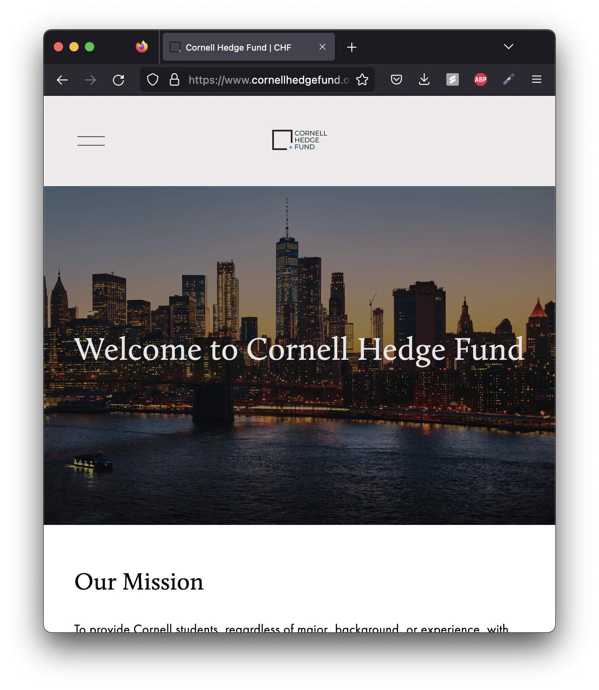

3. [Cornell Consulting Link](https://www.cornellconsultingclub.org/)

   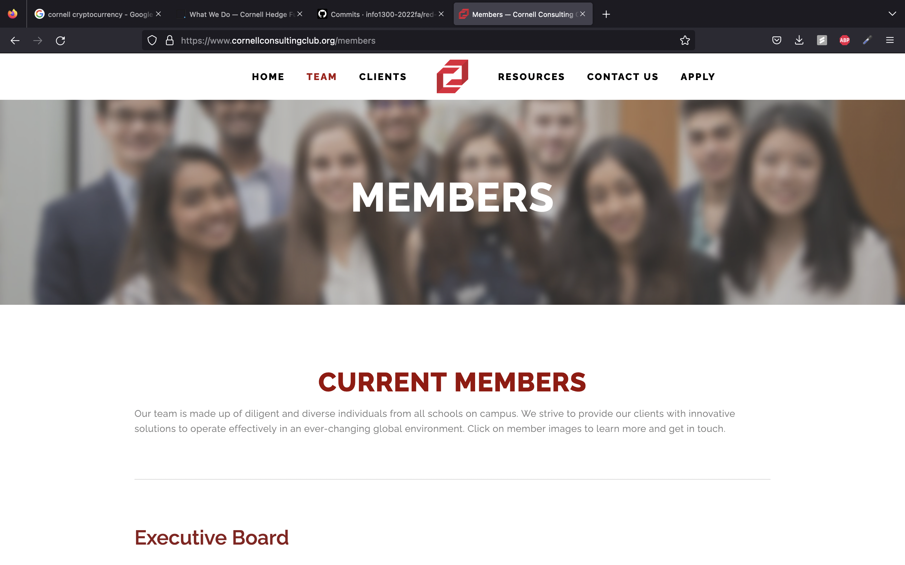

   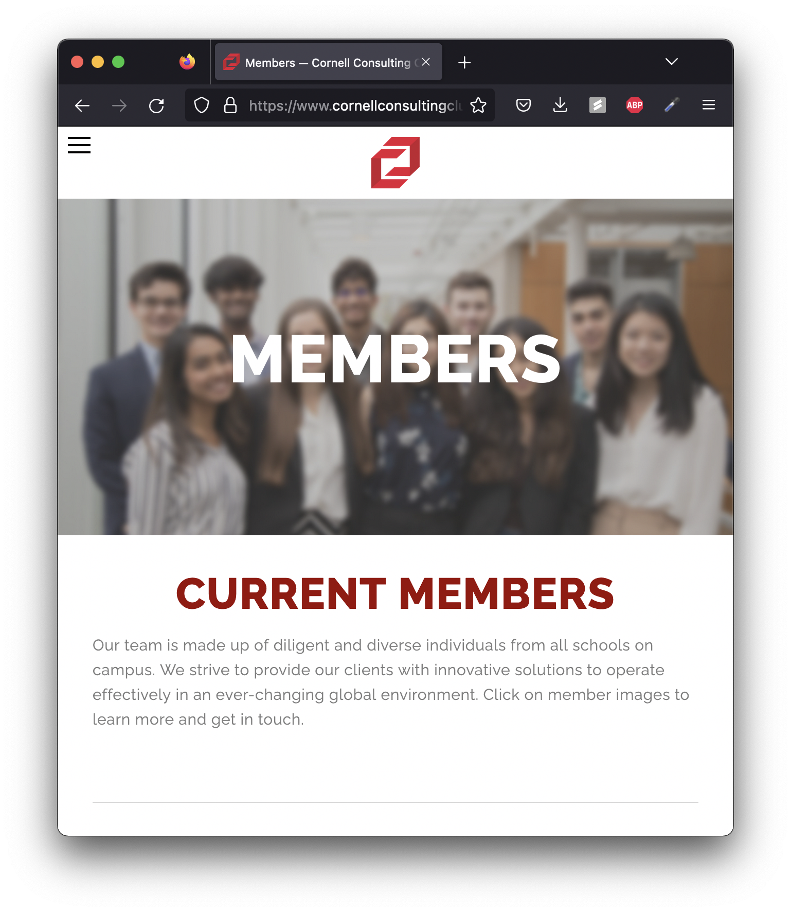

### Example Website 1 Review (Milestone 2)

> Review the website you identified above. (1 paragraph)
> In your review, include a discussion common design patterns and interactivity in the site.

Cornell Blockchain does a great job at segmenting their information, and implementing a clean, professional design (white background, strong contrasts, sharp edges, and sans-serif font). Some interactivity features I noticed were, a hamburger navigation menu when the screen collapses into a narrower screen and darkening icons on clickable elements.

### Example Website 2 Review (Milestone 2)

> Review the website you identified above. (1 paragraph)
> In your review, include a discussion common design patterns and interactivity in the site.

Cornell Hedgefund also does a great job at separating their information and ultilizing a professional design. Furthermore, unlike Cornell Blockchain, their website theme is consistent across multiple webpages. I especially like their use of hero images, and professional color scheme (white, navy blue, and gray). Their website also makes excellent use of a hamburger dropdown menu on smaller screens, and icon darkening when hovering over clickable elements.

### Example Website 3 Review (Milestone 2)

> Review the website you identified above. (1 paragraph)
> In your review, include a discussion common design patterns and interactivity in the site.

Cornell Consulting does a great job at implementing a sleek, professional theme, just like the previous two websites: white background, sans-serif font, sharp edges, etc. They also implement a hamburger menu and icon darkening. There are dropdown menus nested inside the hamburger menu. Some page names have a "+" beside them, indicating that a dropdown menu will appear if one of the sections is clicked. This pattern makes the navbar easy to follow.

## Content Planning (Milestone 2)

Plan your site's content.

### Your Site's Planned Content (Milestone 2)

> List **all** the content you plan to include your website.
> You should list all types of content you planned to include (i.e. text, photos, images, etc.)

- Past speaking events with photos (2021 salon series, 2021 Talks, 2022 Talks)
- Team member photos and brief descriptions
- Application information (including applying to be a speaker, nominating a speaker, and applying to be a club member)
- History and story of TedxCornell
- Story of TED
- Mission of the club
- Frequently asked questions (more about events, the club, and involvement)
- Social media and email
- Entry to join the mailing list

UPDATES:

- Delete "entry to join the mailing list" because this is out of the project scope.
- Add "social media and email" for the audience to connect with the club or get updates about future events and recruitment.

### Content Justification (Milestone 2)

> Explain (about a paragraph) why this content is the right content for your site's audience and how the content addresses their goals.

These content decisions satisfy our audience's goals by giving our audience the information they need to learn more about TEDxCornell and the information they need to apply if they want to.

The past speaker events are essential for giving users some idea about what type of events TEDxCornell hosts. They also motivate some audience to apply as a speaker. In addition, introducing group members and the club's story on the website makes the club look active and mature, also implying what kind of students would fit into the club for visitors who want to apply. Social media and email contacts enable the audience to get updates about future events and recruitment or ask questions. TED's story is also necessary as our client emphasizes that TED's sponsorship makes TEDxCornell unique and more professional.

## Information Architecture (Milestone 2)

### Content Organization (Milestone 2)

> Document your **iterations** of card sorting here. You must have at least 2 iterations of card sorting.
> Include photographic evidence of each iteration of card sorting **and** description of your thought process for each iteration.
> Please physically sort cards; please don't try and do this digitally.

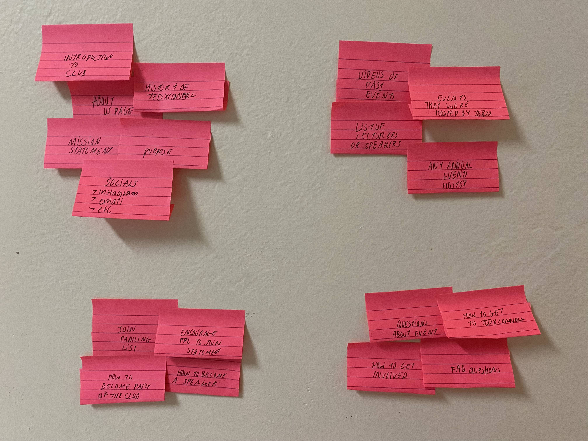
In my first card sort, I had four sections focusing on 1) learning about TedXCornell, 2) learning about past events and what TedXCorenll is currently doing, 3) how to get connected with TedxCornell, and 4) other information on TedxCornell. In the first section, I started out thinking that I needed an about me section. This would serve as an introduction to the club. I also thought it would be more informative if the history was put next to the introduction, along with the mission statement, purpose, and socials. For my next section, I realized that I should put all content about events in one blob together. Having videos of past events, information on past speakers, annual events that might be hosted, and perhaps videos of the event themselves. Next, everything I thought that would relate to connecting with tedxcornell was put in a blob together. I put together a mailing list, information on how to become part of tedxcornell, how to become a speaker, and an excerpt encouraging people to join TedxCornell. Lastly, all information that I thought wouldn't fit in the other sections were put together. I thought that users would want to have an information section. I started knowing we wanted an FAQ content space. After that I knew there would be questions on the location of tedxcornell, how to get involved, and general questions on the event itself.

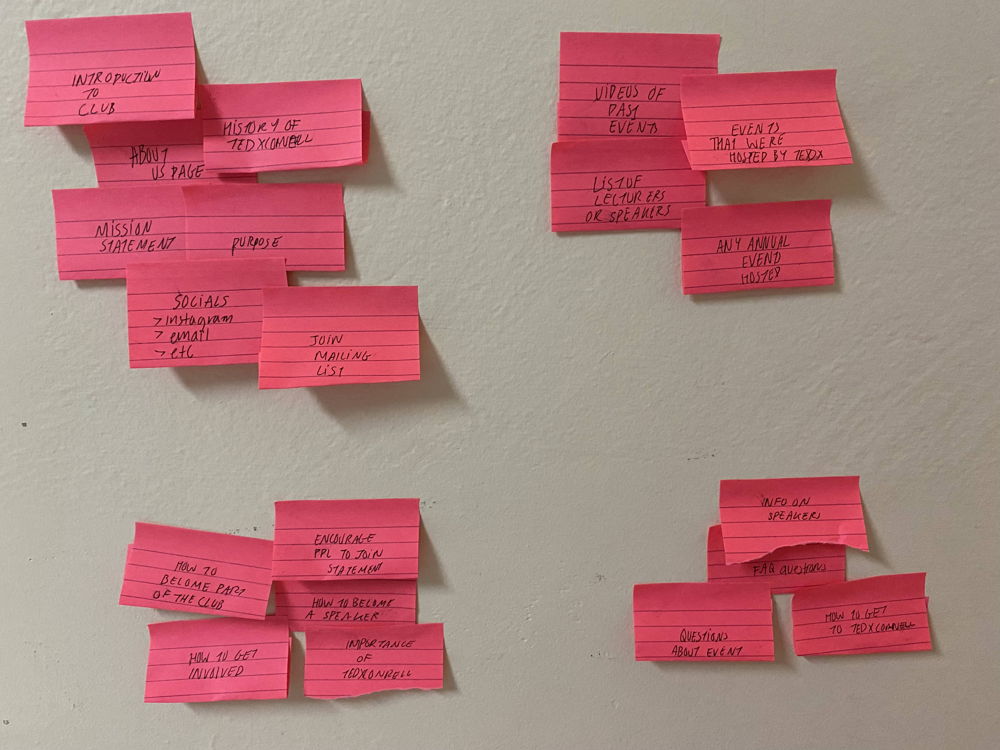
My second cardsort builds off my original cardsort with different iterations. Instead I put the mailing list in the first section rather than having it in the social section. I thought that people may want to join the mailing list after reading the about me section. Instead of putting information on how to get involved in the last section, I put it in the 3rd section which all seemed to focus on connecting with TedxCornell. Lastly, I added a post it on how to get information on the speakers and the expereience.

UPDATES: After milestone 2, we came together to reorganize our content and come up with a better card sorting before we updated our code.
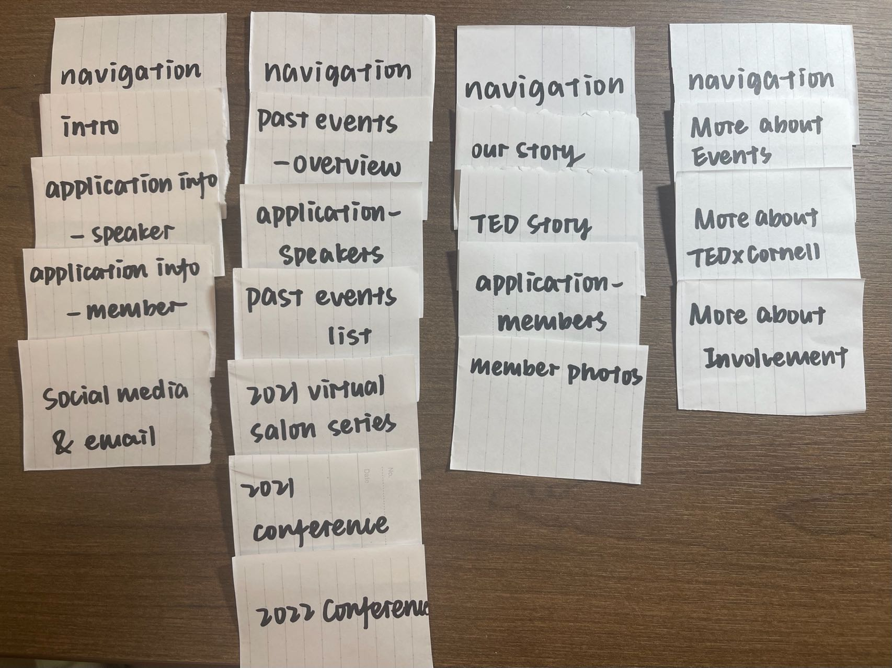

The difference between this one and iteration 2 is that the third page changed from Apply to Our Story. We realized that in iteration 2 we put almost everything about the team on the Home page, but Home was not a good place for content like members' photos. So we plan to make a new page for the team and its history. We will put the content initially in the Apply page on the Home page and other pages. Some of the content initially on the home page will be put on Our Story. The home page becomes more concise so that the audience don't get impatient reading through it.

### Final Content Organization (Milestone 2)

> Which iteration of card sorting will you use for your website?

We are planning on using card iteration 3.

> Explain how the final organization of content is appropriate for your site's audiences.

Our audience are interested in getting involved in the team, so we put the application information in the Home page so that they can see it immediately. The Past Events page is very easy to follow as it puts together photos and descriptions of events that the club held. Information about the "activity" is all in this page. Our Story is the place where potential applicants get an impression of how the team develops and works. Information about the "people" is all in this page. Other information is put in FAQ. After the visitor looks at specific sessions of the site and feels like they still have questions unanswered, they can go to FAQ.


### Navigation (Milestone 2)

> Please list the pages you will include in your website's navigation.

- Home
- Past Events
- Our Story
- Frequently Asked Questions

> Explain why the names of these pages make sense for your site's audience.

These are appropriate names for our sites, because our home page will have general information about the club and getting involved, past events will house past event content, our story page will be about the history of the club and members, and frequently asked questions will contain common questions that our target audience might have.

## Visual Theme (Milestone 2)

> Discuss several (more than two) ideas about styling your site's theme. Explain why the theme ideas are appropriate for your target audiences. Note the theme you selected for your site and why it's appropriate for the audience and their goals.

Our first theme idea is professional: white background, muted red, gray, and black, sans-serif font, sharp edges, and sparingly use of drop shadows. We believe that this theme is appropriate because it follows what many would expect from a "business website": conservative colors with simple but decisive design choices. We believe this theme could be appropriate because it gives off strong first impressions to our audience.

Another theme idea we had was a more "future" theme, as TEDxCornell has a focus on creating ideas oriented towards "new" ideas. This would include more "futuristic" banners and hero images, perhaps with a monospace font. We believe this theme could be appropriate because it suits the brand that TEDxCornell tries to portray.

Our last theme idea was a more club-like theme, slightly less uptight than the professional theme. We believe this theme could be appropriate because at the end of the day, TEDxCornell is a student organization.

## Design (Milestone 2)

Document your site's layout.

## Interactivity Brainstorm (Milestone 2)

> Using the audience goals you identified, brainstorm possible options for interactivity to enhance the functionality of the site while also assisting the audience with their goals.
> Briefly explain idea each idea and provide a brief rationale for how the interactivity enhances the site's functionality for the audience.
> Note: You may find it easier to sketch for brainstorming. That's fine too. Do whatever you need to do to explore your ideas.

- Hamburger menu on narrower screens: A hamburger menu save space on narrow screens. It makes the website more clean and organized, which echoes back to our professional theme. It also helps the audience find the information they want as quickly as possible.

- Dropdown menus in the main navbar (wide screens) and the hamburger menu (narrow screens). The Past Events page is long, so it will be helpful to let the audience jump to a specific subsection of the page from the navbar.

- Button darkening on mouse hover: When a button is hovered over, the color of the button will darken. This is to provide feedback to the audience's actions and to tell them clicking on that element will trigger interactivity.

- Accordion in the FAQ page: The audience always go to the FAQ page with a question already in mind. The question title is the most important identifier of whether they can find what they want in this page. Hiding the answers initially lets users focus on the questions and browse them through. After that, they can simply leave (if nothing found) or click the question to see the answer. This interactivity blocks other content in the page that might be unnecessary for the audience.

- A slideshow which automatically advances for the lineup of speakers in the Past Event page. Currently, the photos of speakers and their topics take up a lot of spaces. These can be made a slideshow, where each slide introduces a speaker. The audience can change the slides by themselves, and the slides also alternate automatically after several seconds.

### Layout Exploration (Milestone 2)

> Iterate on your site's design through sketching.
> Sketch both the narrow and wide versions of the site.
> Here you are just exploring your layout ideas. You don't need to sketch every page.
> Include some of your interactivity ideas in your sketches.
> Provide an explanation for each sketch explaining the idea and the design patterns you are leveraging.


In this design, I focused on a more clean and professional look. The decided on using a gray background color for the navigation and the header. I thought having a gray top would make it stand out against the white background. I also thought it make more sense since the TEDxCornell logo has white and red colors, so naturally the font should be white. After that I incorporated some of the interactivity such as the carousel, dropdown menu, and the accordion for the desktop. For the mobile design, I stuck with the same design pattern but created a white hamburger menu at the top left. The font will be smooth which the images will have sharp corners. I chose to have contrasting colors to compliment the background.


For my second design I still wanted to stay with the clean and professional look. I made alterations on where I wanted to have my slider and where I wanted my colors. I changed my header color to white which I thought would fit in with the white background. I then wanted to direct attention to the middle of the page so I made one half a slider and the other half have a gray background. Since dark gray and white are complimentary to each other it will stick out against the background. In that gray area I wanted to have the "About Us" introductary paragraph. Having a design like this will quickly grab the audiences attention while also showing them pictures of what TEDxCornell does

### Final Design (Milestone 2)

> Include the final sketches for each of your pages.
> **Include your final interactivity in your sketches.** Include annotations to explain what happens when the user takes an action with your interactivity.
> The sketches must include enough detail that another 1300 student could implement them.
> However, you don't need to provide layout/CSS annotations.
> Please, provide an explanation for each sketch.

\*\* IMPORTANT! UPDATES: The feedback to our milestone 2 mentioned that we need better sketches with more details. For each page we recreated the sketch and rewrote explanations. We kept the old sketches here but please jump to the end of this session titled "NEW SKETCHES". Old and new ones might look different because we also reorganized content as mentioned above.

**Narrow Design:**


For the mobile design, you would need a div class for the top, so class= container. Here you would center the logo at the middle and have button called "hamburger". After this, you need a carousel under it, so you would need a carousel class and 3 images with a class and individual ids. After this, you would have the written section under it using headings and paragraphs.


This is relatively the same on both narrow and wide views with possible exeptions of the navigation but overall all looks the same. In the final Design of the FAQ page, there is a page title/header, then a blurb about the details of the page. Lastly, the main content of the pages are sets of question and answers of common questions and answers. When the users click different pages it takes them accordingly. There is not much interactivity on this page.

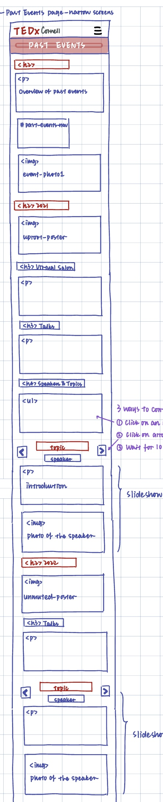

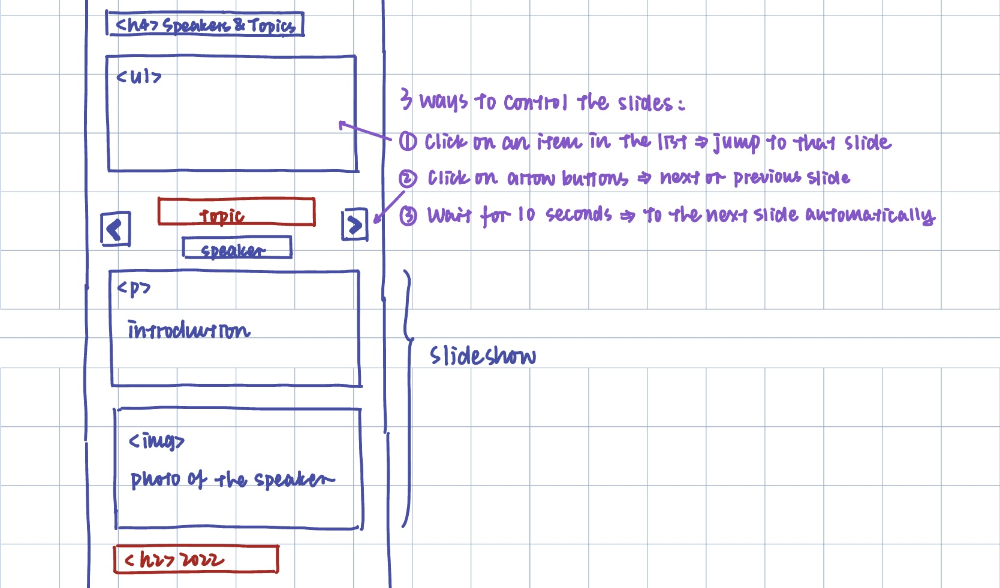

The layout comforms to the conventional pattern for narrow screens -- text and images are put in columns. Alignment is also important, because slight misalignments can make the audience think that the club is not professional enough. To maximize usability (and to shorten the page), two slideshows are implemented on the page. This pattern is different from the original website where all the speaker descriptions and photos are listed in columns. With the slideshow, the audience don't have to scroll down and down and down. There are three ways to alternate the slides so that the audience can trigger the interactivity efficiently.

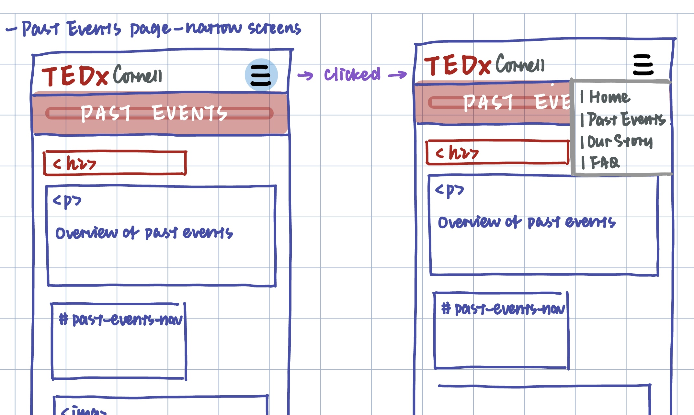
This sketch explains what will happen when the audience click the hamburger menu on their mobile. When the button is clicked again, the navbar is set back to hidden.

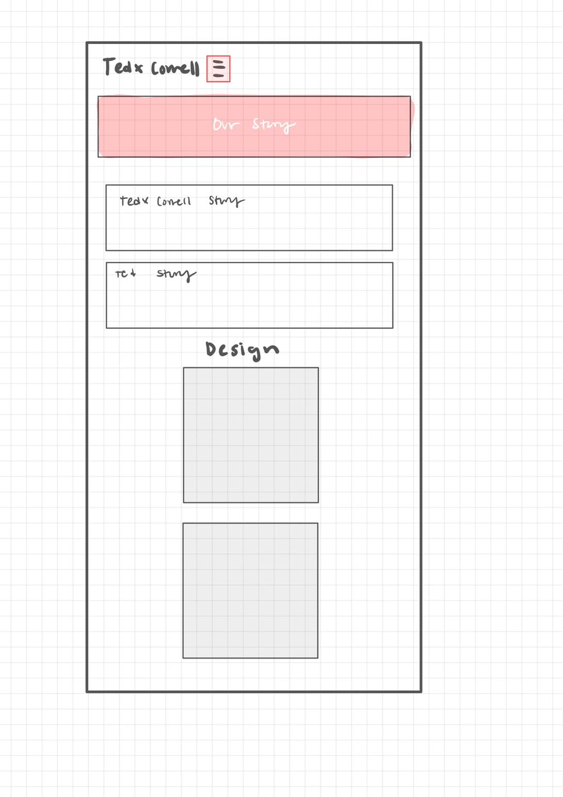
Our story displays tedxcornell information with ted information along with team member information and photos in row flexbox containers.

**Wide (Wide) Design:**


For the desktop, there needs to be a div container for the top. I would call that a class "container". Here you would need the logo img on the right, and then the nav, li, ul, a on the right. For the CSS, you would make the font family sans-serif, display the whole thing as a flex, make it a row flex-direction, and float the nav to the left. I also thought it would be beneficial if you could hover and make it red.
After that there would have to be a div container for the entire middle, I called the class "middle". You would need a class for the carousel, so class= "carousel". Here there would be 3 images and buttons for the arrows ans dots. The images would have individual IDs. After this you would need a div class for the written section, so class is "written". You would need to make class= "middle" a flex, so display flex and flex direction is row. You would make the written section flex is a column. After this you should use the javascript snippets from class for the carousel.


This is relatively the same on both narrow and wide views with possible exeptions of the navigation but overall all looks the same. In the final Design of the FAQ page, there is a page title/header, then a blurb about the details of the page. Lastly, the main content of the pages are sets of question and answers of common questions and answers. When the users click different pages it takes them accordingly. There is not much interactivity on this page.

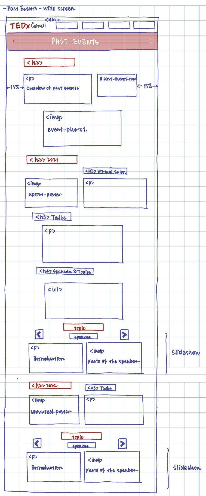
On wider screens, images and text can be put in row. For example, the description and photo of a speaker are now side by side so that the audience can glance through more information at a time. However, white spacing is still important, and the main content only makes up 70% of the window width. Such design helps establish the professional tone.

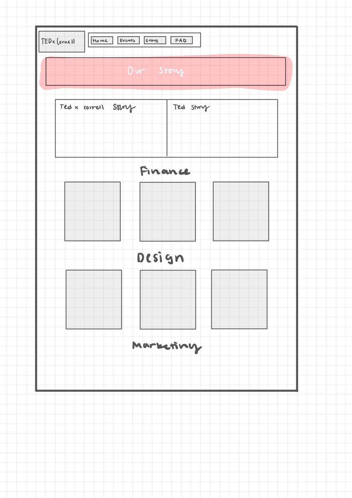
Our story page on narrower screens changes from row flexboxes to column flexboxes to avoiding squeezing images. Furthermore, the ted information and tedxcornell information are stacked on top of each other to make more effective use of space.

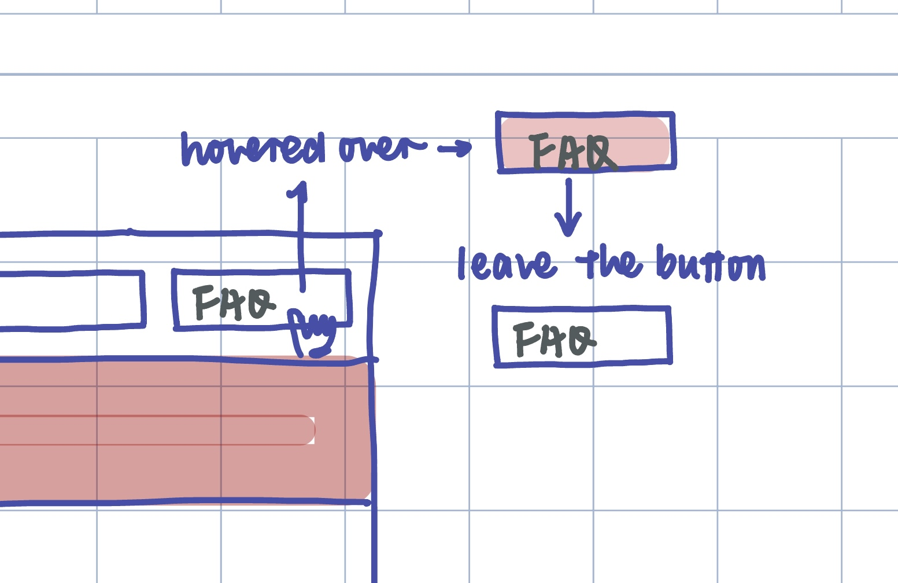
This shows how buttons change color when they are hovered over.

**NEW SKECTHES:**

\*\* Highlighted green area indicate clickable buttons.

- For all pages

The main navbar is at the top of each page, following the convention. For narrow screens, a hamburger menu is used while for wider screens, we have enough space to display the whole list.

There is a background image for the main heading (h1) in each page to make the site visually pleasing.

Every page has a footer. When the audience finish reading a page, they don't have to scroll up to the main navbar but just click on the footer to get to another page. They can also click on the icons of social media if they feel like they need more information or updates.

- Home page

Layout:
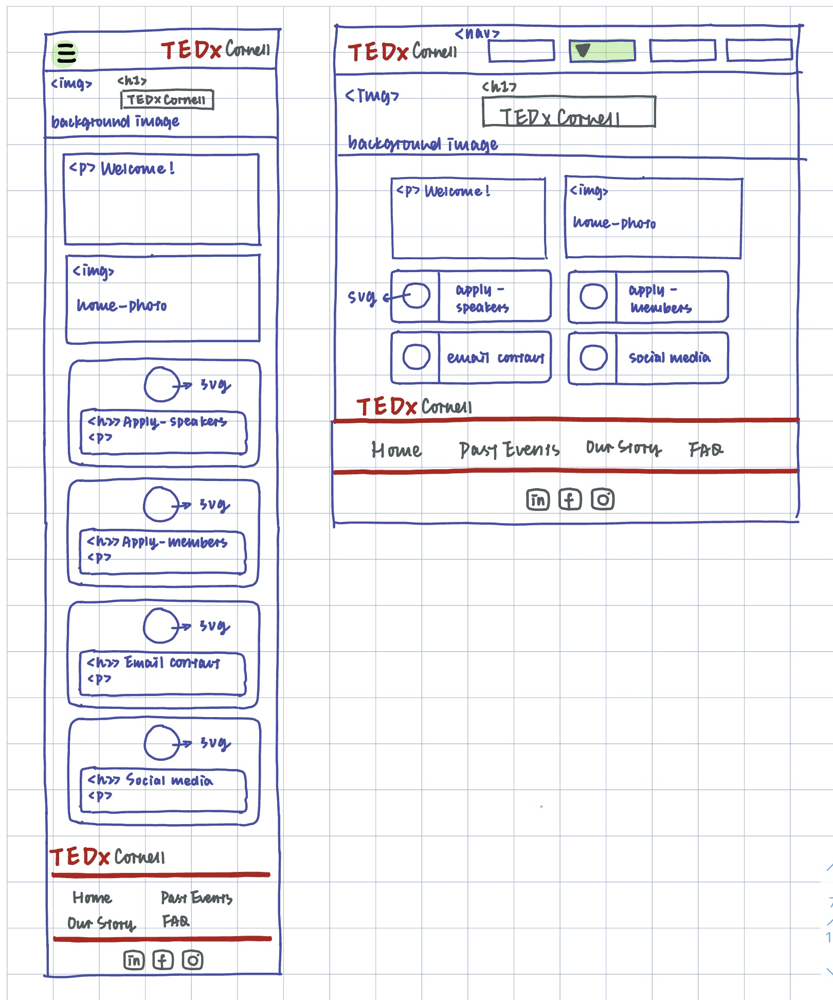

The new TedXCornell Home page includes big chunks of easily seen content. This home page sets the theme for the entire website. We designed with big boxes and application links which is the purpose of this website. The design is mean to follow audience goals so the main most important goals and content are simply on the first page. The first page has wide big boxes that look somewhat similar on mobile or regular pages and sets a consistent beautiful theme.


Interactivity:

Hamburger menu and dropdown menu for narrow screens -- Home as example:
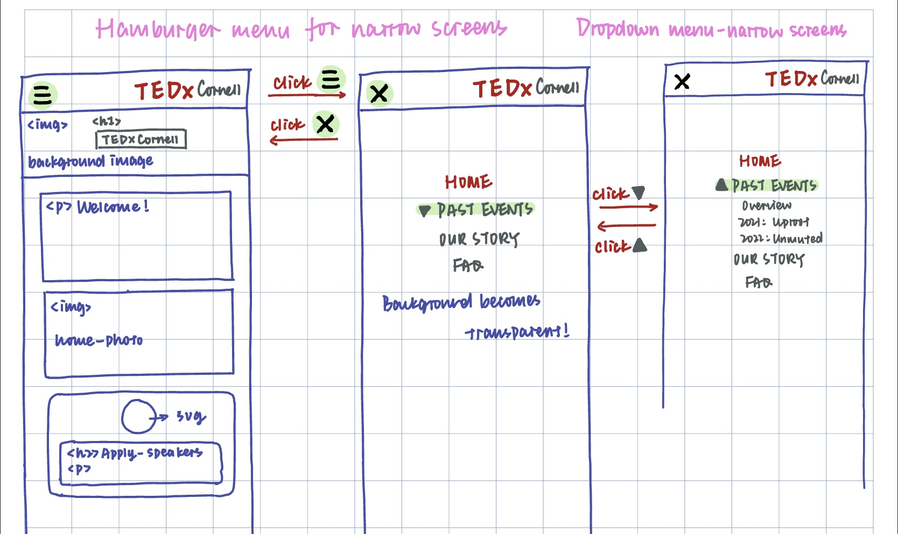

From the first piece to the second piece shows how the hamburger menu works. The trigram icon is a common choice for hamburger menu, so we can safely assume that the audience know to click on it to see the navbar. After it is clicked, the navbar appears and occupies the whole page, blocking other information on the window. This pattern lets the audience focus on the navbar without being distracted. The cross button and the trigram button alternates. We can also assume that the audience know to click on the cross to close the navbar, because this is the traditional pattern.

From the second piece to the third piece shows the dropdown menu for narrow screens. The arrow icon beside Past Events enhances the affordance of this interactivity, because it provides strong clues for how to trigger the interactivity and what to expect. The direction of the arrow button will be reversed when the dropdown content is displayed, providing timely feedback to audience's actions.

Dropdown menu for wide screens -- Home as example:
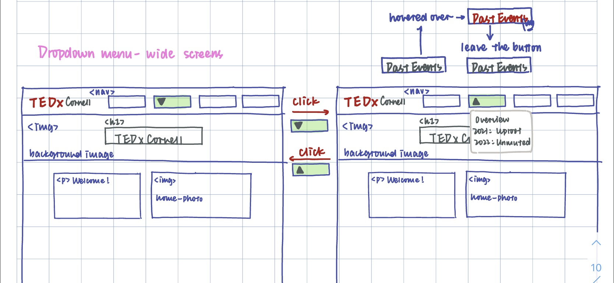

For wide screens the dropdown menu has a white background and grey border when displayed, which blocks other information in the background. The list element changes from black to red when being hovered over, which strengthens the interactivity feedback. When the audience hover over the piece and see the color change, they know this piece is "clickable."

- Past Events page

Layout:
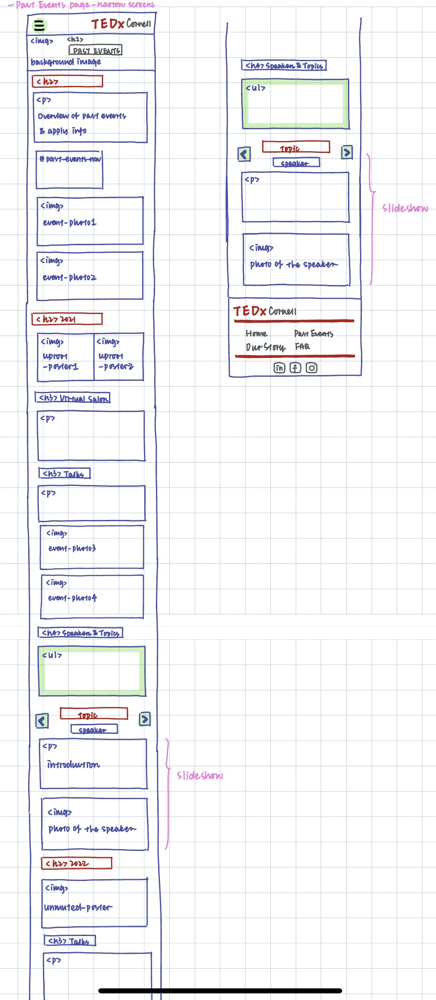

For narrow screens, every paragraph or image spans the whole width of the window to maximize usability. This page follows a simple design pattern without anything special. But this pattern makes the website more formal; we don't need any surprising layout to impress the audience but just to convey information efficiently. There are h2, h3, and h4 elements throughout the page. They are distinguished by their colors and font sizes so that the audience can detect the hierarchy of content in this page.

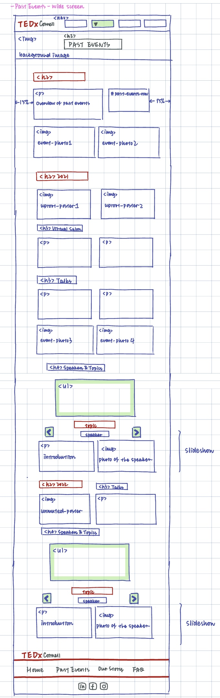

For wide screens, paragraphs and images are put in rows when necessary. White spacing on the right and left margin makes the site less crowded and cleaner.

Interactivity:

Slideshow of speakers:
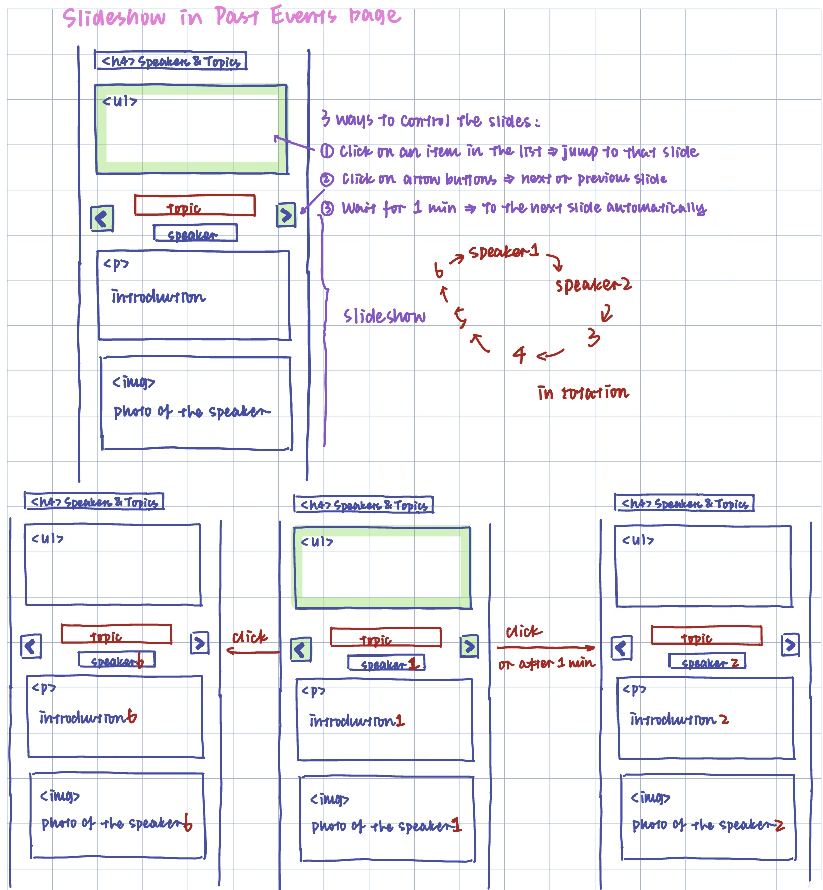

The arrow buttons hint the audience about the interactive feature and enable them to actively, not passively, control the slides. They are made big so that the audience notice them easily. In addition, visitors can click on the list elements above the slideshow to control the displayed slide. When a list element is hovered over, its color changes from black to red, indicating that it is clickable.

- Our Story

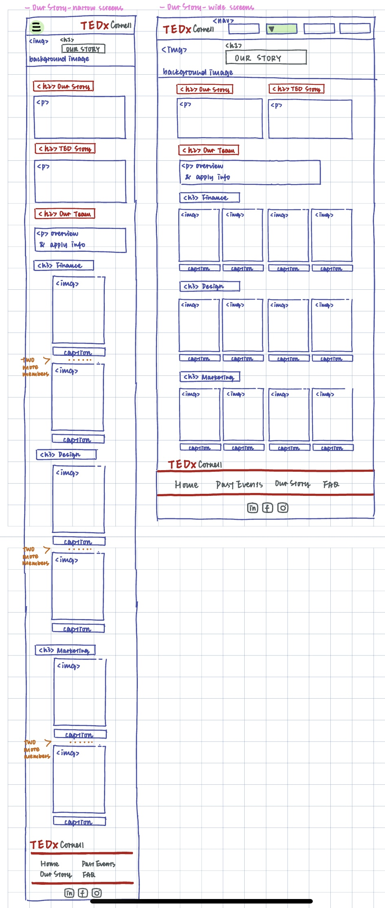
Our Story design incorporates a hero image, and two informational row flexboxes side by side to juxtapose the history of TEDxCornell vs. TED. Beneath these informational paragraphs, we display current members in row flexboxes, where every flexbox incorporates four members, along with headers that describe the team that the corresponding members are a part of. This creates a an organized framework that allows our audience to easily follow the team organization. Furthermore, our story page switches from row flexboxes to column flexboxes from wider to narrower screens to make more effective use of space, and avoid "squeezing" of team member images.

- FAQ

Layout:
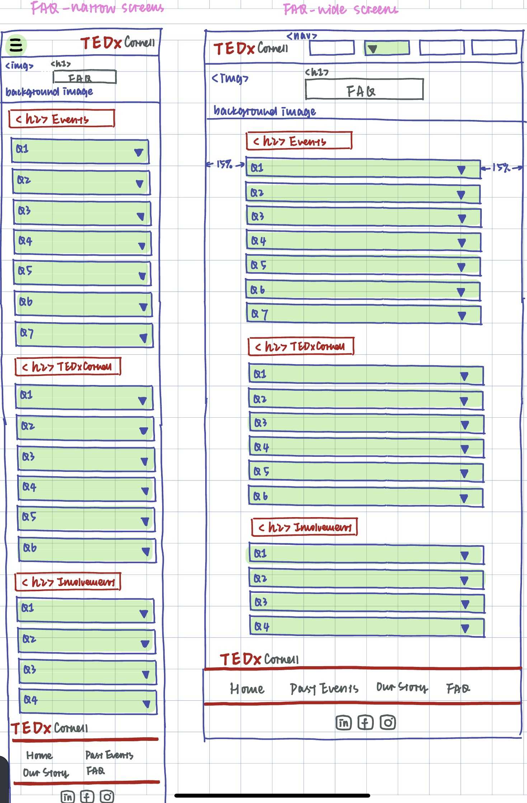

This is relatively the same on both narrow and wide views, except for the right and left margin on wider screens. Questions are divided into subsessions with noticeable headings.

Interactivity:
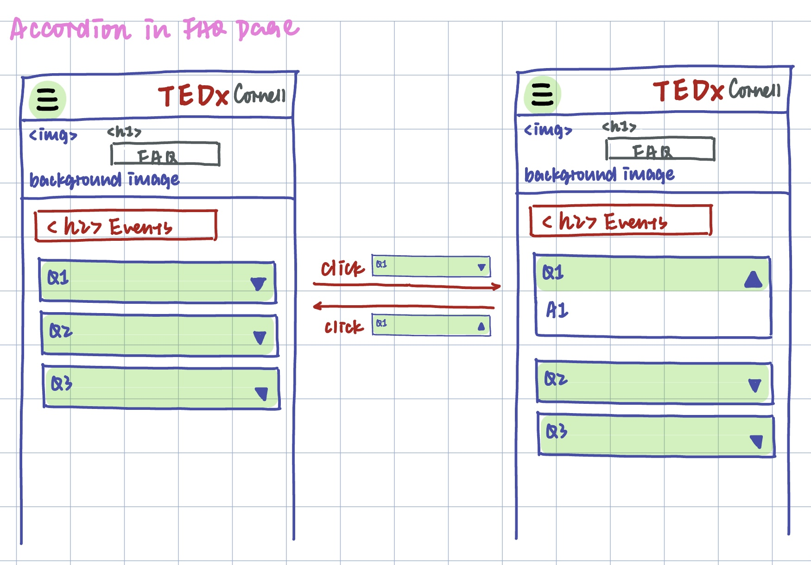

### Design Rationale (Milestone 2)

> Explain why your design is appropriate for your audience.
> Specifically, why does your content organization, navigation, and site design/layout meet the goals of your users?
> How did you employ **design patterns** to improve the familiarity of the site for your audience?

Our audience are interested in getting involved in the team, so we put the application information in the Home page so that they can see it immediately. The Past Events page is very easy to follow as it puts together photos and descriptions of events that the club held. Information about the "activity" is all in this page. Our Story is the place where potential applicants get an impression of how the team develops and works. Information about the "people" is all in this page. Other information is put in FAQ. After the visitor looks at specific sessions of the site and feels like they still have questions unanswered, they can go to FAQ. The main navbar enables the audience to locate the information they want and get there quickely.

Our main visual theme is professional. Our audience are potential members and speakers. So if the site looks casual, they would think that the club is not reliable. Being professional and formal is really important.

Most of my audience should be familiar with the layout pattern: text and images in columns on the mobile page and in rows on the laptop page. The content spans as wide as possible on narrow screens while appropriate white spacing is applied to wider screens to enhance readability and usability. Slight misalignments are avoided so that the website looks more professional and visually pleasing.

## Interactivity Rationale (Milestone 2)

> Describe the purpose of your proposed interactivity.
> Provide a brief rationale explaining how your proposed interactivity addresses the goals of your site's audience and enhances their user experience.

UPDATES: Elaborated on the purpose of our interactivity.

- A hamburger menu on narrower screens will increase real estate for more essential content. It also makes the site clean and neat. Our audience come to the website to learn about the club, and a cleaner layout conveys the message to the audience that the club is professional and formal.

- The dropdown menu for Past Events page lets the visitors know the structure of this long page and locate their needed content efficiently. For example, one visitor who are interested in becoming a speaker in the 2023 conference clicks on the button and sees the dropdown menu. If they wants to look at the most recent event, they can click on "2022 Talks" and will be taken directly to the session without scrolling down and down.

- The slideshow of speakers in Past Events saves space. The audience don't have to scroll down and down and down to see all the speakers but just click on the next or previous buttons. Our audience are not merely those who want to become a speaker. Others who want to join the team might only want to look at the general form of TEDxCornell's events without looking into the speakers. In this case they can easily skip the slideshow and continue to another event.

- The accordion pattern in the FAQ page helps block other content that might be unnecessary for the audience so that they can quickly find information they want. The audience always go to the FAQ page with a question already in mind. Hiding the answers initially lets users focus on the questions and browse them through. After that, they can simply leave (if nothing found) or click the question to see the answer.


## Interactivity Plan (Milestone 2)

> Now that you've designed your interactivity for your site, you need to plan how you will implement it.
> Describe how you will implement the interactivity. This should be a complete plan that another 1300 student could use to implement the interactivity.
> You should list the HTML elements, CSS classes, events, pseudocode, and the initial state.

UPDATES: We sketched them out in more details.

1. Hamburger menu


```
If window size grows larger than 700px:
   add .hidden to #burger

If #burger is clicked:
   add .hidden to #burger
   remove .hidden from #cross
   add .transparent to .main
   remove .hidden from #main-navbar

If #cross is clicked:
   remove .hidden from #burger
   add .hidden to #cross
   remove .transparent from .main
   add .hidden to #main-navbar
```

2. Slideshow

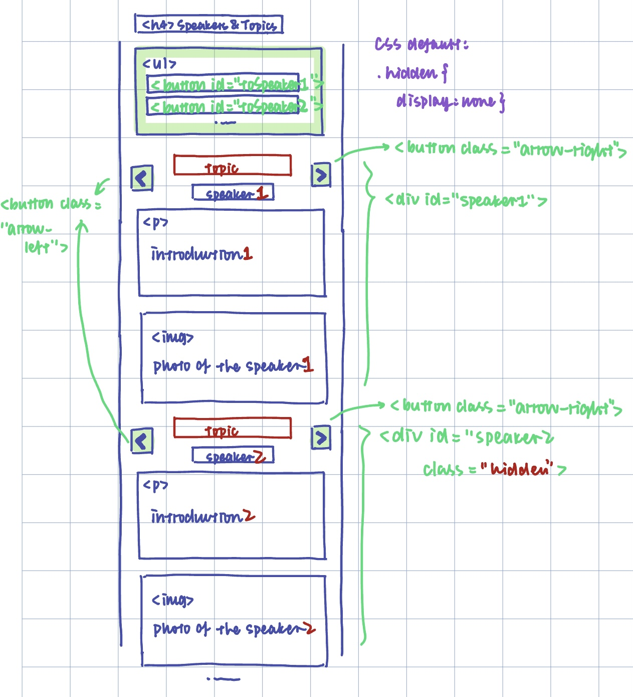


```
If (#speaker1 > .arrow-right) is clicked OR after #speaker1 has been displayed for 1min:
    remove .hidden from #speaker2;
    add .hidden to #speaker1;
If (#speaker1 > .arrow-left) is clicked:
    remove .hidden from #speaker6
    add .hidden to #speaker1

The same applies to slides 2-6.

......

When #toSpeaker1 is clicked:
    remove .hidden from #speaker1
    add .hidden to the current slide

When #toSpeaker2 is clicked:
    remove .hidden from #speaker2
    add .hidden to the current slide

......
```

3. Dropdown menu

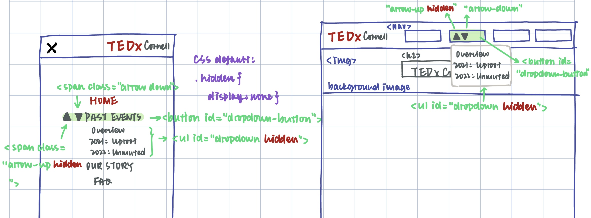

```
When #dropdown-button is clicked:
    remove .hidden from #dropdown
    remove .hidden from (#dropdown > .arrow-up)
    add .hidden to (#dropdown > .arrow-down)

When #dropdown-button is clicked AGAIN:
    add .hidden to #dropdown
    add .hidden to (#dropdown > .arrow-up)
    remove .hidden from (#dropdown > .arrow-down)
```

4. Accordion in FAQ

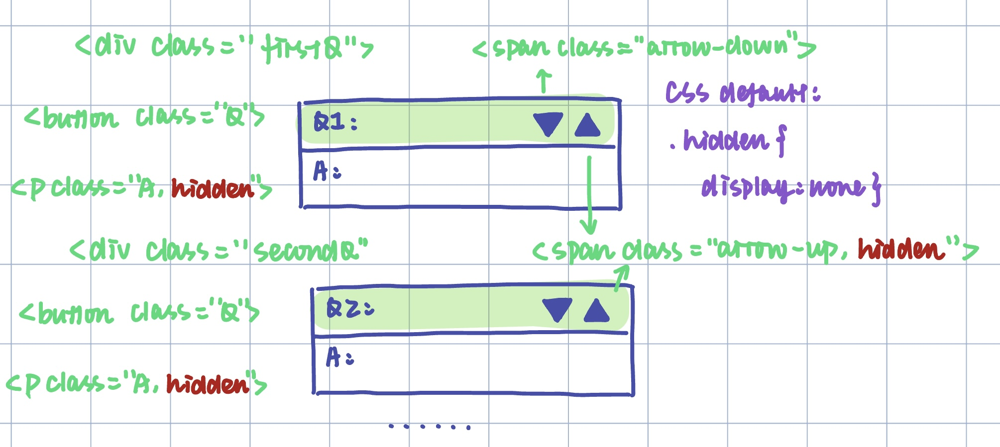

```
When (.firstQ > .Q) is clicked:
    remove .hidden from (.firstQ > .A)
    remove .hidden from (.firstQ > .Q > .arrow-up)
    add .hidden to (.firstQ > .Q > .arrow-down)
When (.secondQ > .Q) is clicked:
    remove .hidden from (.secondQ > .A)
    remove .hidden from (.secondQ > .Q > .arrow-up)
    add .hidden to (.secondQ > .Q > .arrow-down)
......

When (.firstQ > .Q) is clicked AGAIN:
    add .hidden to (.firstQ > .A)
    add .hidden to (.firstQ > .Q > .arrow-up)
    remove .hidden from (.firstQ > .Q > .arrow-down)
......
```

## Client Feedback & Minutes (Milestone 2)

> You should meet with your client again to obtain feedback on your design.
> Provide a summary of the client's feedback and your meeting's minutes.

OVerall, liked the addition of a dropdown menu and a slider. They wanted the accordion to be bigger on the screen for the FAQ. They liked how we kept the original colors of TEDxCornell. They also added how they liked how we stuck to the theme of professional and formal.

15 minutes

## User Testing (Final Submission)

**Conduct user testing with a minimum of 1 participant for every member of your team.**

### User Testing Tasks (Final Submission)

> Plan out your user testing tasks before doing your user testing.
> These must be actual user testing tasks.
> **Tasks are not questions!**

1. Find where to apply to the Club TedX Cornell.

2. Find sufficient information about TedX cornell Such as who can help organize events.

3. Learn about specific previous TedX Cornell Events.

### Participant 1 (Final Submission)

> Using your notes from above, describe your user by answering the questions below.

1. Who is your user, e.g., where does the user come from, what is the user's job, characteristics, etc.?

   Luis M. is a sophomore at Cornell University. He is a full time student and is a fun guy that is on the Cornell Breakfree dance team.

2. Does the user belong to your audience of the site?

   > If “No”, what’s your strategy of associating the user test results to your audience’s needs and wants? How can your re-design choices based on the user tests make a better fit for the audience?

   No they are not as they are not interested in joining TedX cornell. We made our website very informative about Ted as a whole as well so it can be interesting for non audiences as well. I can still associate the results as they applied to other clubs and use a similar process.

### Participant 1 -- Testing Notes (Final Submission)

> When conducting user testing, you should take notes during the test.

For the first task of finding where to apply, on the home page, they easily scrolled down and found the apply but they scrolled past at first and then went back and found it. For the second task they quickly went to the FAQ page easily to find info and clicked the first drop down and found where people can organize events. For the last task, they went to the past events page and read about the different few events.

### Participant 2 (Final Submission)

> Using your notes from above, describe your user by answering the questions below.

1. Who is your user, e.g., where does the user come from, what is the user's job, characteristics, etc.?

   Emily C is from San Diego Ca and is a student at Cornell university. They are fun and are studying Hotel Administration.

2. Does the user belong to your audience of the site?

   > If “No”, what’s your strategy of associating the user test results to your audience’s needs and wants? How can your re-design choices based on the user tests make a better fit for the audience?

   No, they are not part of my audience but they also apply to many clubs and most club websites have similar website formatting based on convention. I can have them do more general tasks such as learn stuff about the club which I did.

### Participant 2 -- Testing Notes (Final Submission)

> When conducting user testing, you should take notes during the test.

For participant two, she found the apply boxes quickly. She was stumped on the second task to find the faq questions and did not know where to look. She kept scrolling down then changing tabs and ultimately found where to go after going to our story tab. Lastly, she found the past events easily.

### Participant 3 (Final Submission)

> Using your notes from above, describe your user by answering the questions below.

1. Who is your user, e.g., where does the user come from, what is the user's job, characteristics, etc.?

   Junior L. is a junior from Chino Hills CA, and works out a lot.

2. Does the user belong to your audience of the site?

   > If “No”, what’s your strategy of associating the user test results to your audience’s needs and wants? How can your re-design choices based on the user tests make a better fit for the audience?

   No not part of my audience as they are not into TedXCornell but they also are part of Breakfree club and applied to other clubs before. I can make questions more general as usual.

### Participant 3 -- Testing Notes (Final Submission)

> When conducting user testing, you should take notes during the test.

This user found all the tasks very quickly with no complications. They quickly found the tab box to apply. Then they found the faq page and looked around. Then they went to past events and looked around.

### Participant 4 (Final Submission)

> Using your notes from above, describe your user by answering the questions below.

1. Who is your user, e.g., where does the user come from, what is the user's job, characteristics, etc.?

   Lavinia is a junior at Cornell, studying Info Science.

2. Does the user belong to your audience of the site?

   > If “No”, what’s your strategy of associating the user test results to your audience’s needs and wants? How can your re-design choices based on the user tests make a better fit for the audience?

   No. She does not want to join the TEDx team or be a speaker. But she has experiences applying to other clubs through their websites, so she should be familar with the tasks provided by us. We should be safe to generalize the test result to our audience.

### Participant 4 -- Testing Notes (Final Submission)

> When conducting user testing, you should take notes during the test.

1.
- quickly looked at the main navbar
- "ok, no Apply page"
- scrolled down in Home
- saw the entry to apply as a member

2.
- looked to the navbar
- went to Our Story
- "here is much info about the club"

3.
- looked to the navbar
- went to Past Events -- 2022 Talks
- read through the session

### Participant 5 (Final Submission)

> Using your notes from above, describe your user by answering the questions below.

1. Who is your user, e.g., where does the user come from, what is the user's job, characteristics, etc.?

   Junior L. is a junior from Chino Hills CA, and works out a lot.

2. Does the user belong to your audience of the site?

   > If “No”, what’s your strategy of associating the user test results to your audience’s needs and wants? How can your re-design choices based on the user tests make a better fit for the audience?

   No not part of my audience as they are not into TedXCornell but they also are part of Breakfree club and applied to other clubs before. I can make questions more general as usual.

### Participant 5 -- Testing Notes (Final Submission)

> When conducting user testing, you should take notes during the test.

This user found all the tasks very quickly with no complications. They quickly found the tab box to apply. Then they found the faq page and looked around. Then they went to past events and looked around.

## Website Revision Based on User Testing (Final Submission)

> What changes did you make to your design based on user testing?

From the user testing, it is clear one of the main goals to learn about the club and where to apply is easy to find which is a success. One change we made was to make the FAQ more consise so users did not have to scroll through every question. We put the most Frequently asked questions or have users figure out where they need guidance then questions accordingly. Overall, the testing was successful and little change is needed.

## Grading (Final Submission)

### Collaborators (Final Submission)

> List any persons you collaborated with on this project.

TedxCornell

### Reference Resources (Final Submission)

> Please cite any external resources you referenced in the creation of your project.
> (i.e. W3Schools, StackOverflow, Mozilla, etc.)

https://devcom.w3schools.com/jquery/jquery_hide_show.asp

https://www.w3schools.com/howto/howto_css_image_text.asp
