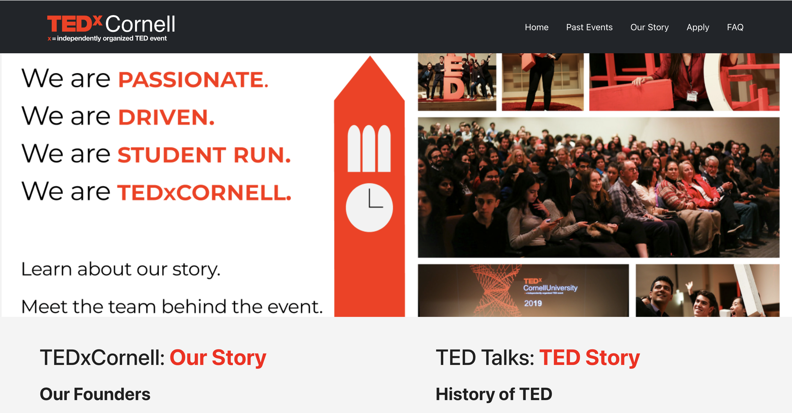
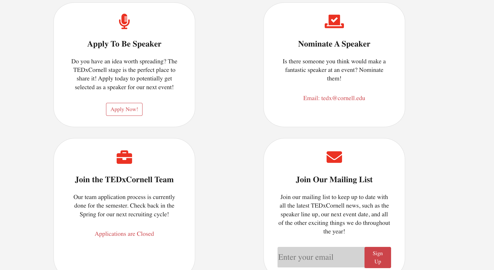
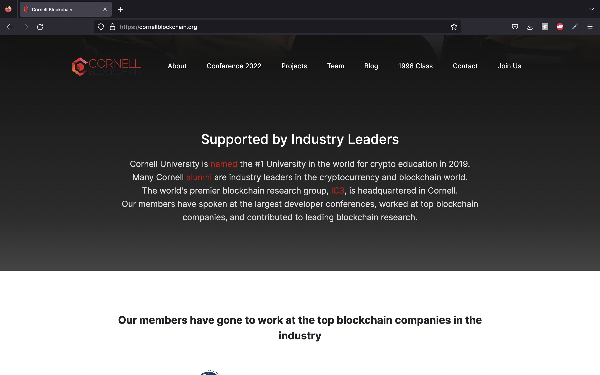
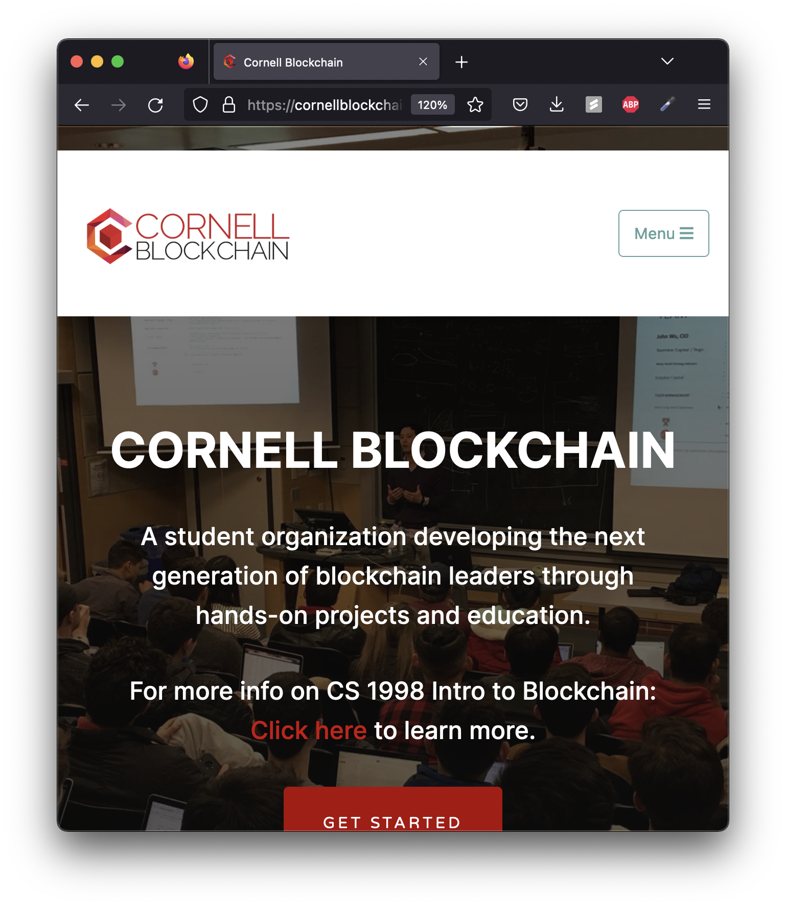

# Group Project: Design Journey

**For each milestone, complete only the sections that are labeled with that milestone.** Refine all sections before the final submission.

You are graded on your design process. If you later need to update your plan, **do not delete the original plan, leave it in place and append your new plan _below_ the original.** Then explain why you are changing your plan. Any time you update your plan, you're documenting your design process!

**Replace ALL _TODOs_ with your work.** (There should be no TODOs in the final submission.)

Be clear and concise in your writing. Bullets points are encouraged.

**Everything, including images, must be visible in _Markdown: Open Preview_.** If it's not visible in the Markdown preview, then we can't grade it. We also can't give you partial credit either. **Please make sure your design journey should is easy to read for the grader;** in Markdown preview the question _and_ answer should have a blank line between them.

## Client (Milestone 1)

### Client Description (Milestone 1)

> Tell us about your client. Who is your client?
> Explain why your client meets the client rules in the project requirements.

- TEDxCornell is a club at Cornell. It hosts annual speaking events and focuses on sharing new opinions and ideas.
- TEDxCornell meets our project requirements because the website is not made for any specific member on our team. TEDxCornell is a professional organization that has real needs and wants to have a redesigned website.

### Client Questionnaire (Milestone 1)

> Develop a client questionnaire to learn more about your client and their goals.
> You may use the questionnaire below, you may modify the questionnaire below, or you may create your own.

1. Describe your organization and its purpose.

   - TEDxCornell is an organization dedicated to giving a platform to people with unique opinions
   - Is a student run organization located at Cornell University
   - Provides a voice to people who otherwise wouldn’t have one
   - Gathers a large variety of people

2. What makes your organization and its services special or unique?

   - Sponsored by the official TEDx
   - Sponsored by local companies

3. Why are you looking for a new website or updating your existing site?

   - Thinks there needs to be a better form
   - Wants to change from google forms to internal forms on the website
   - Wants improvements on the presentation of the website
   - Thinks presentation contribute a lot to the website (specifically appealing to viewer)

4. Who do you want to visit your site? Who do you believe is your website's intended audience?

   - Cornell students
   - Maybe attract speakers (professors …)

5. When visiting your site, what actions do you want your visitors to take?

   - Would like an “about” page
   - FAQ would be nice
   - Page on sponsorships
   - Some information on past events
   - How to apply to be on TEDxCornell page

6. What are your goals for this site?

   - To make the website and the organization look professional
   - To learn more about TEDxCornell
   - To attract speakers

7. Is there a "feel" that you want for your site? Are there colors or imagery that you have in mind?

   - More professional website
   - More formal
   - Sharp contrast between the images and the white background
   - More formal and sophisticated font

8. What are your favorite competitors or similar organizations' websites? Why?

   - The official website TEDx: neat; efficient representation of information, look professional
   - Cornell Blockchain: background black and white, look professional

9. Besides the content of the existing site, what else do you want to add? Will you provide it to us?

   - New images for the website

### First Client Meeting Minutes/Notes (Milestone 1)

> Include your notes/minutes from your first meeting with your client.

- Meeting took roughly 15 minutes
- Attendees: all members and the client
- See notes above
- Main points:
  - Seemed to have wanted a more professional and formal website
  - Wanted to attract people who want to speak for TEDxCornell
  - Formal font
  - Contrasting images
  - Emphasis on wanting a forms page
  - Focus on design and presentation

### Client Website (Milestone 1)

NOTE: after meeting with the client, we discussed and wrote the rationale together.

> Tell us about the website that your client wants.
> Tell us the purpose of the website and what it is all about.
> Note: **If you are redesigning an existing website, give us the current URL and some screenshots of the current site.** (FireFox makes it easy to take a full screenshot of a page from the context menu (right click).)
> If you are redesigning an existing site, tell us how you plan to update the site in a significant way that meets the project's requirements.

- Our client wants a more formal and professional look to his website. For this project I think it would be best to have a plain white background, with contrasting images, and with a more formal font like sans serif. The purpose of this website is to attract potential speakers for TEDxCornell and for viewers to learn more about what TEDxCornell is all about. We are planning to add more content to the existing website and potentially upgrade the presentation of it. We also want to add more images and change the organization of the current pages to make it more readable and appealing to the viewer.
- https://www.tedxcornell.com/team <- Current website link for TEDxCornell

### Client Goals (Milestone 1)

> Identify your client's goals for the website.
> What kind of website do they want? What are their goals for the site?
> There is no required number of goals. You need as many goals as necessary to reflect your client's desires.

- To build up a general impression on the audience about TEDxCornell (professional)
- To learn more about TEDxCornell (the organization and events)
- To attract speakers

### Client Website Scope (Milestone 1)

> We want your project to be successful! It needs to be ambitious, but not too large.
> A good rule-of-thumb is that you should have about 1 content-full page for each team member.
> Explain why the website you will create for your client isn't too small and isn't too big.
> Explain why you think it's the right size for this project.

- Most of the content will be recycled from the existing website, which has substantial content. The client also asked us to add more content like images. So the website will not be small.
- We will focus on making our content concise and thorough for our viewers. We will also decide which content should not be included if it does not meet the audience's goals. So the website does not get too big.
- As planned, each member will work on one page. We will make the content for each page about the same.

## Plan/Schedule (Milestone 1)

> Make a plan of when you will complete all parts of this assignment.
> This plan is for your team. There is no required format. Format it so that it works for you!
> Your plan should include when you will interview users and analyze their goals.
> Your plan should also include how and when you will assemble/create the sit's content.
> **Tip:** Your team should plan to work ahead. This project really isn't feasible to complete the night before a deadline.

- We aim to complete all milestones on time.
- Week 1: Complete user interviews and website goals.
- Week 2: Complete skeleton code (layout, code organization, etc.)
- Week 3: Fill in pages with content and add styles
- Week 4: Add interactivity

## Understanding Users (Milestone 2)

**Make the case for your decisions using concepts from class, as well as other design principles, theories, examples, and cases from outside of class.**

You can use bullet points and lists, or full paragraphs, or a combo, whichever is appropriate. The writing should be solid draft quality, but it doesn't have to be fancy.

### User Interview Questions (Milestone 2)

> Plan the user interview which you'll use to identify the goals of your site's audience.
> You may use the interview template below and revise it as much as you desire.

**User Interview Briefing & Consent:** "Hi, I am a student at Cornell University. I'm currently taking a class on web design and for a project, I am designing the website for TedxCornell. I'm trying to learn more about the people that might use this site. May I ask you a few questions? It will take about 10 minutes. You are free to quit at any time."

1. Please tell me a bit about yourself. You may omit any personal or private information.

2. Recall the last time you visited a club website, does the website design affect your opinion of the club.

3. Have you visited a well-designed website that looked fine on a desktop but not on mobile? How did it affect your opinion of the the club?

4. Recall the last time you visited any website, were there any features that made the website more accessible, such as a hamburger burger?

...

n. What haven't I asked you today that you think would be valuable for me to know?

**After the interview:** "This was really helpful. Thank you so much for agreeing to speak with me today. Have a great day!"

### Interview Notes (Milestone 2)

> Interview at least 1 person for every member of your team from your audience.
> Take notes and include those notes here. Make sure to include a brief description of each interviewee.
> **Copy the interview questions above into each interviewee section below.**
> Take notes for each participant inline with the questions.

**Interviewee 1:**

Monica Lee is a second-year student at Cornell; she is a transfer from Boston College. She is part of TEDxCornell.

1. Please tell me a bit about yourself. You may omit any personal or private information.
   Hi, I'm a speaker curation member at TEDxCornell. (After asking year and major) I'm a sophomore, and I am currently a Hotelie.
2. Recall the last time you visited a club website, does the website design affect your opinion of the club.
   I think first impressions do matter. If I saw a website that wasn't well-put together it would give me the impression that the club isn't organized or professional. On the other hand, seeing a great website does make me believe a club is well-run.
3. Have you visited a well-designed website that looked fine on a desktop but not on mobile? How did it affect your opinion of the the club?
   Sometimes, I run across this. It really depends on how bad it is. Usually some overlapping text is OK, but ideally it would not be there.
4. Recall the last time you visited any website, were there any features that made the website more accessible, such as a hamburger burger?
   I think giving feedback when a user submit forms could help.

**Interviewee 2:**

TODO: tell us a bit about your participant

TODO: copy interview questions
TODO: take notes inline with questions

**Interviewee 3:**

TODO: tell us a bit about your participant

TODO: copy interview questions
TODO: take notes inline with questions

TODO: add additional interviewees as needed

**Interviewee 4:**

TODO: tell us a bit about your participant

TODO: copy interview questions
TODO: take notes inline with questions

TODO: add additional interviewees as needed

### Goals (Milestone 2)

> Analyze your audience's goals from your notes above.
> List each goal below. There is no specific number of goals required for this, but you need enough to do the job (Hint: It's more than 1 and probably more than 2).

Goal 1: TODO: brief title

- **Design Ideas and Choices** _How will you meet those goals in your design?_
  - TODO: design ideas
- **Rationale & Additional Notes** _Justify your decisions; additional notes._
  - TODO: rationale

Goal 2: TODO: brief title

- **Design Ideas and Choices** _How will you meet those goals in your design?_
  - TODO: design ideas
- **Rationale & Additional Notes** _Justify your decisions; additional notes._
  - TODO: rationale

Goal 3: TODO: brief title

TODO: design ideas and rationale

TODO: add as many goals as needed

### Audience (Milestone 2)

> Briefly explain your site's audience.
> Be specific and justify why this audience is a **cohesive** group with regard to your website.

TODO: site's _cohesive_ audience

## Website Design Exploration (Milestone 2)

Identify three websites (preferably static websites) that exist today on the web to draw inspiration from. Please select websites that are similar to the website you wish to create.

Include two screenshots of the home page for each site: narrow and wide.

**We'll refer to these are your "example websites."**

1. <TODO: website url>

   

   

2. <TODO: website url>

   

   

3. <TODO: website url>

   

   

### Example Website 1 Review (Milestone 2)

> Review the website you identified above. (1 paragraph)
> In your review, include a discussion common design patterns and interactivity in the site.

TODO: website reflection/critique

### Example Website 2 Review (Milestone 2)

> Review the website you identified above. (1 paragraph)
> In your review, include a discussion common design patterns and interactivity in the site.

TODO: website reflection/critique

### Example Website 3 Review (Milestone 2)

> Review the website you identified above. (1 paragraph)
> In your review, include a discussion common design patterns and interactivity in the site.

TODO: website reflection/critique

## Content Planning (Milestone 2)

Plan your site's content.

### Your Site's Planned Content (Milestone 2)

> List **all** the content you plan to include your website.
> You should list all types of content you planned to include (i.e. text, photos, images, etc.)

- TODO: content 1
- TODO: content 2
- TODO: content 3
- ...

### Content Justification (Milestone 2)

> Explain (about a paragraph) why this content is the right content for your site's audience and how the content addresses their goals.

TODO: justify your content decisions

## Information Architecture (Milestone 2)

### Content Organization (Milestone 2)

> Document your **iterations** of card sorting here. You must have at least 2 iterations of card sorting.
> Include photographic evidence of each iteration of card sorting **and** description of your thought process for each iteration.
> Please physically sort cards; please don't try and do this digitally.

TODO: photos and explanations of each iteration

### Final Content Organization (Milestone 2)

> Which iteration of card sorting will you use for your website?

TODO: tell us which iteration of card sorting you plan to use.

> Explain how the final organization of content is appropriate for your site's audiences.

TODO: why does this organization make sense for your audience (not you)?

### Navigation (Milestone 2)

> Please list the pages you will include in your website's navigation.

- TODO: page 1
- TODO: page 2
- TODO: page 3
- ...

> Explain why the names of these pages make sense for your site's audience.

TODO: explain why the pages name make sense to the audience.

## Visual Theme (Milestone 2)

> Discuss several (more than two) ideas about styling your site's theme. Explain why the theme ideas are appropriate for your target audiences. Note the theme you selected for your site and why it's appropriate for the audience and their goals.

TODO: theme ideas, rationale, and final theme

## Design (Milestone 2)

Document your site's layout.

## Interactivity Brainstorm (Milestone 2)

> Using the audience goals you identified, brainstorm possible options for interactivity to enhance the functionality of the site while also assisting the audience with their goals.
> Briefly explain idea each idea and provide a brief rationale for how the interactivity enhances the site's functionality for the audience.
> Note: You may find it easier to sketch for brainstorming. That's fine too. Do whatever you need to do to explore your ideas.

- TODO: interactivity idea 1
- TODO: interactivity idea 2
- TODO: ...

### Layout Exploration (Milestone 2)

> Iterate on your site's design through sketching.
> Sketch both the narrow and wide versions of the site.
> Here you are just exploring your layout ideas. You don't need to sketch every page.
> Include some of your interactivity ideas in your sketches.
> Provide an explanation for each sketch explaining the idea and the design patterns you are leveraging.

TODO: layout exploration sketches + explanation

### Final Design (Milestone 2)

> Include the final sketches for each of your pages.
> **Include your final interactivity in your sketches.** Include annotations to explain what happens when the user takes an action with your interactivity.
> The sketches must include enough detail that another 1300 student could implement them.
> However, you don't need to provide layout/CSS annotations.
> Please, provide an explanation for each sketch.

**Narrow (Mobile) Design:**

TODO: narrow sketches and explanation

**Wide (Wide) Design:**

TODO: wide sketches and explanation

### Design Rationale (Milestone 2)

> Explain why your design is appropriate for your audience.
> Specifically, why does your content organization, navigation, and site design/layout meet the goals of your users?
> How did you employ **design patterns** to improve the familiarity of the site for your audience?

TODO: 1 paragraph

## Interactivity Rationale (Milestone 2)

> Describe the purpose of your proposed interactivity.
> Provide a brief rationale explaining how your proposed interactivity addresses the goals of your site's audience and enhances their user experience.

TODO: 1 paragraph

## Interactivity Plan (Milestone 2)

> Now that you've designed your interactivity for your site, you need to plan how you will implement it.
> Describe how you will implement the interactivity. This should be a complete plan that another 1300 student could use to implement the interactivity.
> You should list the HTML elements, CSS classes, events, pseudocode, and the initial state.

TODO: interactivity plan

## Client Feedback & Minutes (Milestone 2)

> You should meet with your client again to obtain feedback on your design.
> Provide a summary of the client's feedback and your meeting's minutes.

TODO: client feedback

TODO: meeting minutes

## User Testing (Final Submission)

**Conduct user testing with a minimum of 1 participant for every member of your team.**

### User Testing Tasks (Final Submission)

> Plan out your user testing tasks before doing your user testing.
> These must be actual user testing tasks.
> **Tasks are not questions!**

1. TODO: task 1

2. TODO: task 2

3. TODO: task 3

TODO: add more tasks if necessary (a good rule of thumb is a task for every user goal)

### Participant 1 (Final Submission)

> Using your notes from above, describe your user by answering the questions below.

1. Who is your user, e.g., where does the user come from, what is the user's job, characteristics, etc.?

   TODO: tell us about the participant

2. Does the user belong to your audience of the site?

   > If “No”, what’s your strategy of associating the user test results to your audience’s needs and wants? How can your re-design choices based on the user tests make a better fit for the audience?

   TODO: (Yes / No)

### Participant 1 -- Testing Notes (Final Submission)

> When conducting user testing, you should take notes during the test.

TODO: participant user test notes

### Participant 2 (Final Submission)

> Using your notes from above, describe your user by answering the questions below.

1. Who is your user, e.g., where does the user come from, what is the user's job, characteristics, etc.?

   TODO: tell us about the participant

2. Does the user belong to your audience of the site?

   > If “No”, what’s your strategy of associating the user test results to your audience’s needs and wants? How can your re-design choices based on the user tests make a better fit for the audience?

   TODO: (Yes / No)

### Participant 2 -- Testing Notes (Final Submission)

> When conducting user testing, you should take notes during the test.

TODO: participant user test notes

### Participant 3 (Final Submission)

> Using your notes from above, describe your user by answering the questions below.

1. Who is your user, e.g., where does the user come from, what is the user's job, characteristics, etc.?

   TODO: tell us about the participant

2. Does the user belong to your audience of the site?

   > If “No”, what’s your strategy of associating the user test results to your audience’s needs and wants? How can your re-design choices based on the user tests make a better fit for the audience?

   TODO: (Yes / No)

### Participant 3 -- Testing Notes (Final Submission)

> When conducting user testing, you should take notes during the test.

TODO: participant user test notes

TODO: add more participants if necessary

## Website Revision Based on User Testing (Final Submission)

> What changes did you make to your design based on user testing?

TODO: explain the revisions to your website from user testing

## Grading (Final Submission)

### Collaborators (Final Submission)

> List any persons you collaborated with on this project.

TODO: list your collaborators

### Reference Resources (Final Submission)

> Please cite any external resources you referenced in the creation of your project.
> (i.e. W3Schools, StackOverflow, Mozilla, etc.)

TODO: list reference resources
